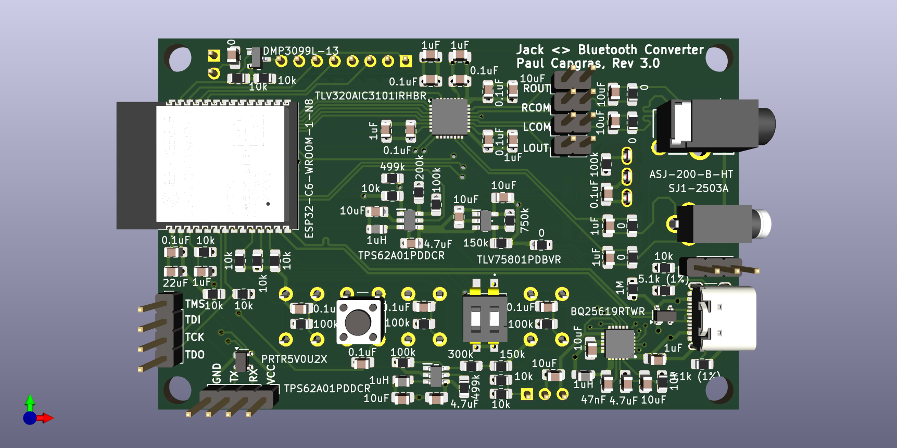

# Jack <> Bluetooth Converter
Revision : 3.0

## Table of Content

1. [Features](#1-features)
2. [Design Specificatin](#2-design-specification)
3. [Repo organization](#3-repo-organization)
4. [Next steps](#4-next-steps)

## 1. Features

This project aims to design a device with the following features:

- Audio input from a 2.5mm audio jack can be sampled and transmitted via Bluetooth to a headphone.
- Digital audio from a smartphone can be received via Bluetooth and converted into analog audio through a 3.5mm audio jack.
- The device can be powered via USB-C or run on battery for up to 3 hours.
- The battery charges when the device is connected to USB-C.
- A screen and buttons allow switching between "Jack to Bluetooth" and "Bluetooth to Jack" modes.
- The screen and buttons enable Bluetooth peripheral selection when the device functions as a Bluetooth central.
- The screen turns off after 1 minute of inactivity to save power.

## 2. Design specification and documentation

Please go to [Jack <> Bluetooth Design Specification](doc/Jack<>Bluetooth-Design-Specification.md) which documents the design choices and provide details on the project.

## 3. Repo organization

`./Components` -> list of all the components with libs (not public yet because of kicad lib licences)

`./doc` -> documentations, specifications and images

`./gerber` -> pcb design files for manufacturing

`./kicad` (not public yet because of kicad lib licences)

`./software` -> ESP32 C code (working in progress)

## 4. Next steps

- PCB review & manufacturing
- finish ox design & 3D printing
- Software

## 5. Revisions history

Please go to [Jack<>Bluetooth-Revision-History](doc/Jack<>Bluetooth-Revision-History.md)
