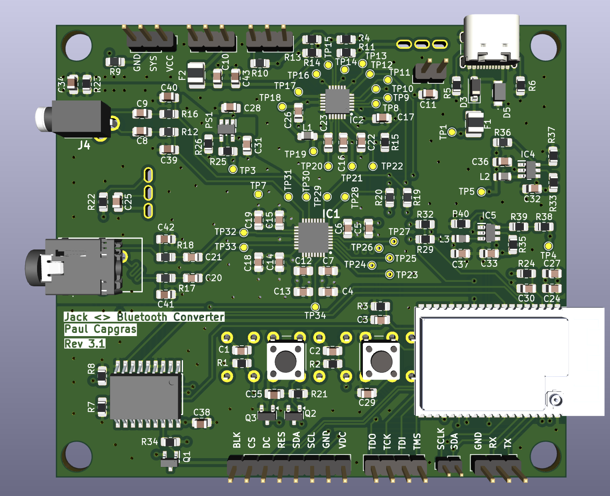
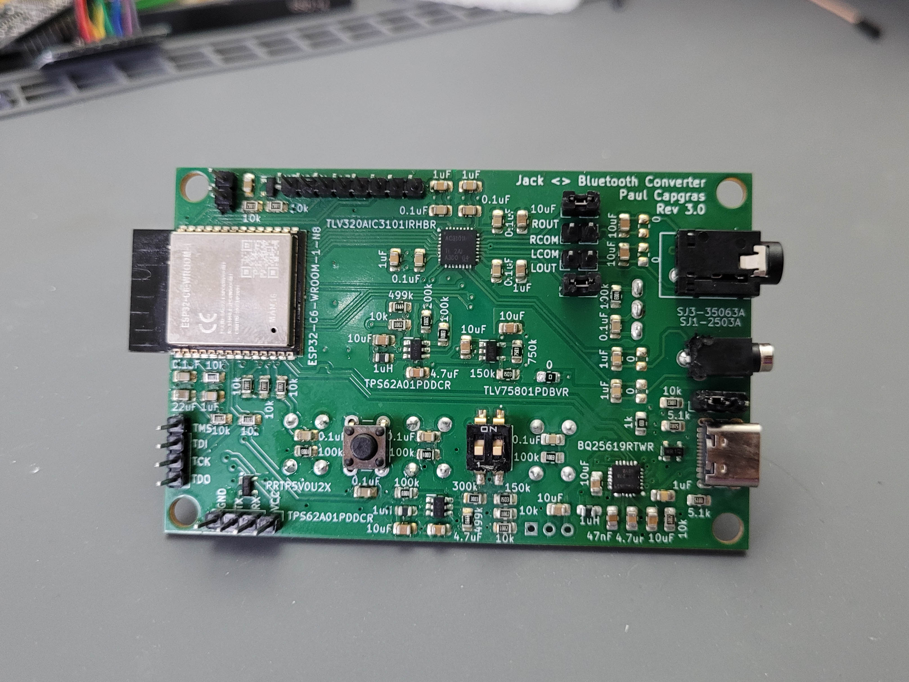

# Jack <> Bluetooth Converter

Revision 3.1 (Not manufactured yet) :

Revision 3.0 (Manufactured) :

## Table of Content

1. [Features](#1-features)
2. [Design Specificatin and documentation](#2-design-specification-and-documentation)
3. [Repo organization](#3-repo-organization)
4. [Next steps](#4-next-steps)
5. [Revision history](#5-revisions-history)

## 1. Features

This project aims to design a device with the following features:

- Audio input from a 2.5mm audio jack can be sampled and transmitted via Bluetooth to a headphone.
- Digital audio from a smartphone can be received via Bluetooth and converted into analog audio through a 3.5mm audio jack.
- The device can be powered via USB-C or run on battery for up to 3 hours.
- The battery charges when the device is connected to USB-C.
- A screen and buttons allow switching between "Jack to Bluetooth" and "Bluetooth to Jack" modes.
- The screen and buttons enable Bluetooth peripheral selection when the device functions as a Bluetooth central.
- The screen turns off after 1 minute of inactivity to save power.

## 2. Design specification and documentation

Please go to [Jack <> Bluetooth Design Specification](doc/Jack<>Bluetooth-Design-Specification.md) which documents the design choices and provide details on the project.

[Software Readme](software/README.md) contains note taking from the software development (work in progress).

## 3. Repo organization

`./Components` -> components list with libs (not public)

`./doc` -> documentations, specifications and images

`./gerber` -> pcb design files for manufacturing

`./kicad` -> Kicad files

`./software` -> ESP32 C code (work in progress)

## 4. Next steps

- Working on a new revision : Rev3.1 to fix the current hardware limitations

## 5. Revisions history

Please go to [Jack<>Bluetooth-Revision-History](doc/Jack<>Bluetooth-Revision-History.md)
