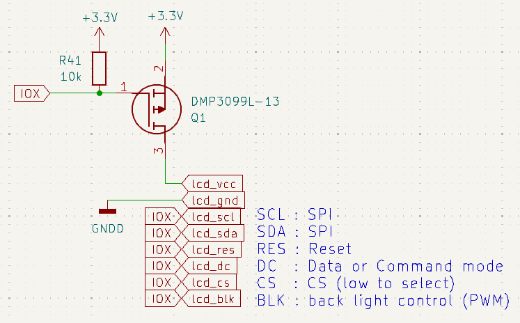
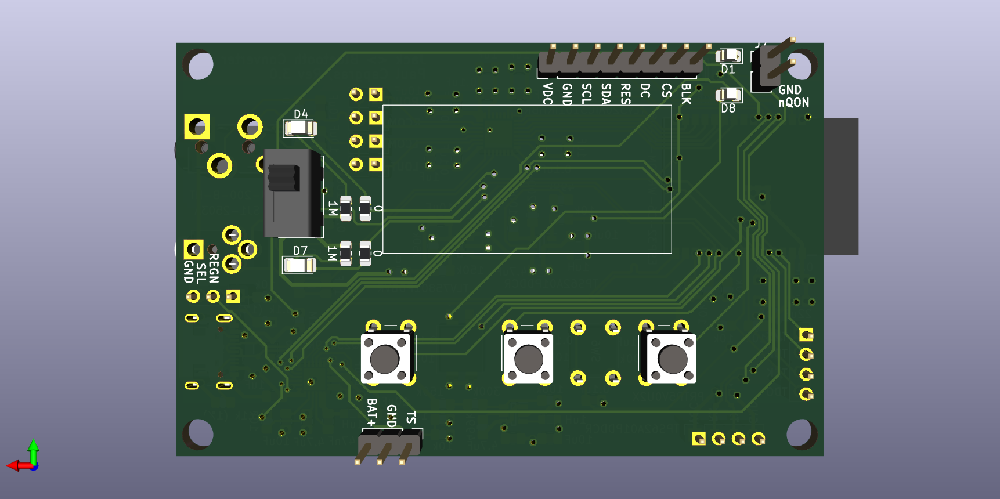
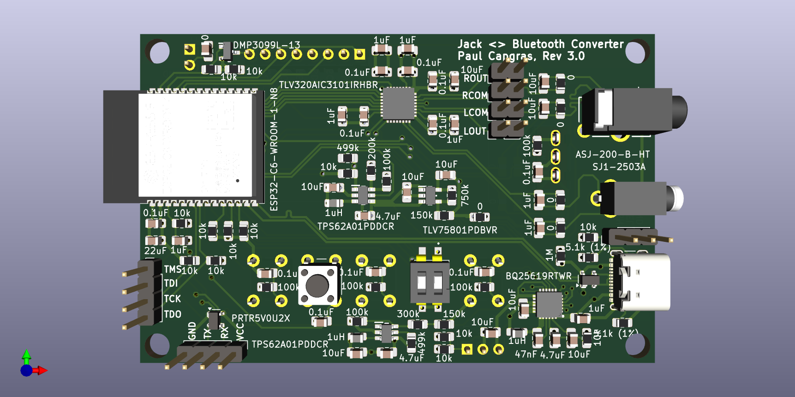

# Jack To Bluetooth Design Specification/Details

## Purpose

The purpose of the *Jack <> Bluetooth Design Specification* is to document the design choices and provide details on this project.

## Table of Content

1. [Jack2Bluetooth features](#jack2bluetooth-features)
2. [Architecture](#2-architecture)
    1. [Jack to bluetooth](#21-jack-to-bluetooth)
    2. [Bluetooth to jack](#22-bluetooth-to-jack)
    3. [Overall Architecture](#23-overall-architecture)
    4. [User interface](#24-user-interface)
3. [Component choices](#3-component-choices)
    1. [MCU](#31-mcu--microcontroller-unit)
    2. [Audio codec](#32-audio-codec)
    3. [Battery](#33-battery)
        1. [ESP32-C6 curruent consumption](#331-esp32-c6-current-consumption)
        2. [TLV320AIC3101 current consumption](#332-tlv320aic3101-current-consumption)
        3. [Current consumption conclusions](#333-current-consumption-conclusions)
    4. [PMIC](#34-pmic--power-management-integrated-circuit)
    5. [LDO](#35-ldo--low-dropout-voltage-regulator)
    6. [Switch Regulator](#36-switching-voltage-regulator-switch)
4. [Electronic schematic](#4-electronic-schematic)
    1. [Jack 3.5mm](#41-jack-35mm)
    2. [Jack 2.5mm](#42-jack-25mm)
    3. [Audio Codec](#43-audio-codec-tlv320aic3101)
    4. [MCU](#44-mcu)
5. [GPIOs pin assignments](#5-gpios-pin-assignments)
6. [Layout](#6-layout)
    1. [Main ideas](#61-layout-main-ideas)
    2. [Impedance matching](#62-impedance-matching)
    3. [Trace length](#63-trace-length)
    4. [Layers](#64-layers)
        1. [Layer 1](#641-layer-1)
        2. [Layer 2](#642-layer-2)
        3. [Layer 3](#643-layer-3)
        4. [Layer 4](#644-layer-4)

# 1. Jack2Bluetooth features

This project aims to design a device with the following features:

- Audio input from a 2.5mm audio jack can be sampled and transmitted via Bluetooth to a headphone.
- Digital audio from a smartphone can be received via Bluetooth and converted into analog audio through a 3.5mm audio jack.
- The device can be powered via USB-C or run on battery for up to 3 hours.
- The battery charges when the device is connected to USB-C.
- A screen and buttons allow switching between "Jack to Bluetooth" and "Bluetooth to Jack" modes.
- The screen and buttons enable Bluetooth peripheral selection when the device functions as a Bluetooth central.
- The screen turns off after 1 minute of inactivity to save power.

# 2. Architecture

## 2.1 Jack to Bluetooth

For audio sampling:

The audio codec must support line-level audio input signals. The ADC is integrated into the audio codec with an amplifier.

## 2.2 Bluetooth to Jack

The audio codec must include a DAC with an amplifier.

## 2.3 Overall architecture

When merging the two previous architecture, it becomes:

And when adding power components and the user interface components, the overall architecture is :

## 2.4 User Interface:

Based on the architecture, the user interface is then:

|User interface    | Direction      |
| ---------------- | -------------- |
| Button Next      | Input          |
| Button Enter     | Input          |
| Button Back      | Input          |
| Button On/Off    | Input          |
| Audio Jack 2.5mm | Input          |
| Usb-C            | Input          |
| Bluetooth        | Input & Output |
| Screen           | Output         |
| Audio Jack 3.5mm | Output         |

# 3. Component choices

## 3.1 MCU : Microcontroller Unit

The ESP32 was chosen due to its widespread availability and ease of use. To simplify RF design, an ESP32 module with an integrated antenna was selected.

Requirements:
- Bluetooth support
- Integrated antenna
- USB, I2S, I2C, SPI inerfaces
- Core frequency (not the max supported but the integrated clock frequency)
- Memory size

Final choice: **ESP32-C-WROOM-N8**.

## 3.2 Audio Codec

The audio codec must include a DAC and an ADC, support line-level audio, and have single-ended inputs and outputs.

Final choice : **TLV320AIC3101** (Texas Instrument).

## 3.3 Battery

The battery should provide at least 3 hours of operation.
The most power-intensive components are the MCU, audio codec, and the screen.

The screen is going to be on only when a user push a button (and stays on for ~30s). Therefore, it should be off in idle mode, in transmitting mode or receiving mode. Since the screen is mostly off, its consumption is negligible.

### 3.3.1 ESP32-C6 Current consumption

According to the esp32-c6 datasheet, the Bluetooth LE current consumption are:

### 3.3.2 TLV320AIC3101 Current consumption

According to its datasheet, it current consumptions are :

So it is negligeable compared to the ESP32-C6 Bluetooth LE transmission currents.

### 3.3.3 Current consumption conclusions

The critical use case for current consumption is during audio sampling and Bluetooth transmission. Assuming the transmission is done at 9dBm, the required battery to power the device 3 hours is around 600mA.

## 3.4 PMIC : Power Management Integrated Circuit

The PMIC should support power path between the USB-C and the battery, battery charging when USB-C is plugged, battery discharging when unplugged.
Since a power on/off system is needed, if this IC could have sleep or deep sleep mode with very low current consumption, it could be nice.

Final choice : **BQ25619RTWR** (Texas Instrument).

All the elements are providing in the first page of product specification:

## 3.5 LDO : Low-dropout voltage regulator

It was decided to use an LDO for the analog to have a clean alimentation. LDO should not be fixed to be able to reuse it in other designs.

Choice was made to use **TLV758P** from Texas Instrument.

## 3.6 Switching Voltage Regulator switch

Choice was made to use the **TPS62A01PDDCR** from Texas Instrument.

# 4. Electronic schematic

## 4.1 Jack 3.5mm

And the ASJ datasheet gives:

1. Sleeve is GND
2. Tip is Left
3. Ring is Right

So the schematic on kicad is:

## 4.2 Jack 2.5mm

The schematic is

## 4.3 Audio Codec (TLV320AIC3101)

The typical application from the spec is:

It is also worth looking at the development board:

The schematic done is then:

4 capacitors are to be determined, C8, C9, C20, C21.

First, C8=C9 and C20=C21.

Then, C8 and Rinput_of_line2R is a high pass filter, where fc = 1/(2*pi*C*R).

From TLV320AIC3101 datasheet, Rinput_of_line2R
is between 20kΩ and 80kΩ depending on the attenuation programmed in the audio codec.

The audio bandwidth is 20-20kHz. A capacitor of 1uF gives fc = 8Hz for R=20kΩ and fc= 2Hz for R=80kΩ which should be good for this application. So C8=C9=1uF.

Under the hyptohesis that the load resistance on the jack 3.5mm is 10kΩ (same hypothesis as in the TLV320AIC3101 datasheet), C20 and Rload are doing an high pass filter. A 10uF capacitor ensures that for Rload > 800Ω, the audio bandwidth is respected. So C20=C21=10uF.

## 4.4 MCU (ESP32-C6-WROOM-1)

The datasheet of the ESP32-C6-WROOM-1 recommend the following schematic:

A good resource is also the [ESP32-C6-DevKitC-1 v1.4](https://docs.espressif.com/projects/esp-dev-kits/en/latest/esp32c6/esp32-c6-devkitc-1/index.html)

Based on this two schematics, the schematic done is:

To boot the option are based on table 7 from the ESP32-C6-WROOM-1 datasheet:

## 4.5 PMIC (BQ25619RTWR)

The typical application from the BQ25619RTWR datasheet is:

The [BQ25619 evaluation module (EVM)](https://www.ti.com/tool/BQ25619EVM) is also a good reference: 

Based on that, the schematic done is :

In this case, since the device is powered by USB-C, PSEL should be connected to HIGH with REGN value. This decision is based on the BQ25619_evm schematic.

PMID_GOOD is connected to REGN through a 10k resistor as described in the pin configuration section of the datasheet.

PMID is connected to a 10uF capacitor following the datasheet typical application.

QON does not need to be pulled high and can stay floating when button not pushed.

Two resistors R28 and R29 need to be determined following section `7.3.6.4.1 JEITA Guideline Compliance During Charging Mode` of the datasheet. Since the default battery used for this project does not have temperature sensor, these resistors are equals to 10k as described in the pin configuration section of the datasheet.

## 4.6 LDO (TLV758P)

The typical application is:

The target analog voltage is 3.3V.
 
R1/R2 = Vout/Vfb - 1 = 5

R1 + R2 <= Vout/(1e-6) = 3.3MΩ 

Decision was to have R1 = 750kΩ and R2 = 150kΩ.
Therefore, the schematic is:

## 4.7 Switch Regulators (TPS62A01PDDCR)

The typical application is :

Two regulators are required to create 1.8V and 3.3V. A voltage divider is built with R1 and R2 to fix the output voltage. 

The first one can follow the same design as the typical application since it was already designed for Vout = 1.8V.

The second one needs to be designed for Vout = 3.3V. The section `8.2.2.1 Setting the Output Voltage` of the datasheet gives R2 <= 100kΩ and R1 = R2(Vout/0.6 - 1) = 4.5*R2

Choice is made to take R1 = 100kΩ, and R2 made with two resistors R2 = 300k + 150k

## 4.8 Screen

The screen is going to be connected through an SPI interface. It will be powered thanks to the 3.3 voltage. However to be able to power off the screen, an electronic circuit is required.

## 4.9 USB-C & UART Connectors 

The schematic done is based on the devkit of the ESP32.

## 4.10 Control Buttons

# 5. GPIOs Pin Assignments

This table contains all the pin assignments. It was done updated during layout to make rooting easier.

|IO°   | Active Mode    | Debug/Bringup|
|------|----------------|--------------|
| IO0  | button_enter   |              |
| IO1  | button_direction|              |
| IO2  | lcd_vcc_ctrl   |              |
| IO3  | lcd_scl        |              |
| IO4  | button_back    | jtag_tms     |
| IO5  | button_next    | jtag_tdi     |
| IO6  | i2c_sda        | jtag_tck     |
| IO7  | i2c_clk        | jtag_tdo     |
| IO8  | led_dac        | boot         |
| IO9  | led_adc        | boot         |
| IO10 | pmic_nINT      |              |
| IO11 | pmic_nCE       |              |
| IO12 | usb_d-         | usb_d-       |
| IO14 | usb_d+         | usb_d+       |
| IO15 | lcd_res        |              |
| IO16 | lcd_sda        | uart_tx      |
| IO17 | lcd_dc         | uart_rx      |
| IO18 | codec_reset_l  |              |
| IO19 | codec_i2s_mclk |              |
| IO20 | codec_i2s_bclk |              |
| IO21 | codec_i2s_wclk |              |
| IO22 | codec_i2s_din  |              |
| IO23 | codec_i2s_dout |              |

# 6. Layout

## 6.1 Layout main ideas

The goals were to have:
- all the high speed signals on the first layer
    - I2S
    - USB data
- all the analog signals on the first layer level and in a define region.
- respect the mecanical constraints for the buttons position. To be able to have a functional box over it.
- have the antena on a side that could be directed toward the user
- use the led in the box.
- match impedance for the usb
- the RF should be far away from the analog
- close to the antenna, there should be no HF signals and as much ground as possible.

The user interface is the back of the PCB:

The spi screen is going to be put in the big white rectangle. The three buttons : previous, enter and next for controlling the screen are put under the screen. A slide switch was added to select the mode between Jack -> Bluetooth or Bluetooth -> Jack. It also controls the two LEDs indicating the direction.

Two more leds are available on the top right corner to indicate if the device is on and the last one to indicate if the device is plugged.

On the other side, the main one, there are all the main components and all the main signals : 

All the inputs/outputs connectors are located on the same slide of the board. The antenna is outside of the board to have the maximum omni-directional radiation pattern. The analog part is as far as possible from the RF.

## 6.2 Impedance matching:

The USB differential pair should be 90ohms.

## 6.3 Trace Length

- usb are the same length (+-0.1mm)
- left and right of jack 3.5mm are the same length (+-0.1mm)
- left and right of jack 2.5mm are the same length (+-0.1mm)
- for I2S:
  - Shortest line : 25.75mm
  - Longest line : 31.42mm
  - delta is 5.67mm. Assuming a delay of 6.2ps/mm, it creates a delay of 35ps which respects the timing requirements of the audio-codec.

## 6.4 Layers

L1 : Signals
L2 : GND
L3 : Power
L4 : Low signals

### 6.4.1 Layer 1

### 6.4.2 Layer 2

### 6.4.3 Layer 3

### 6.4.4 Layer 4

