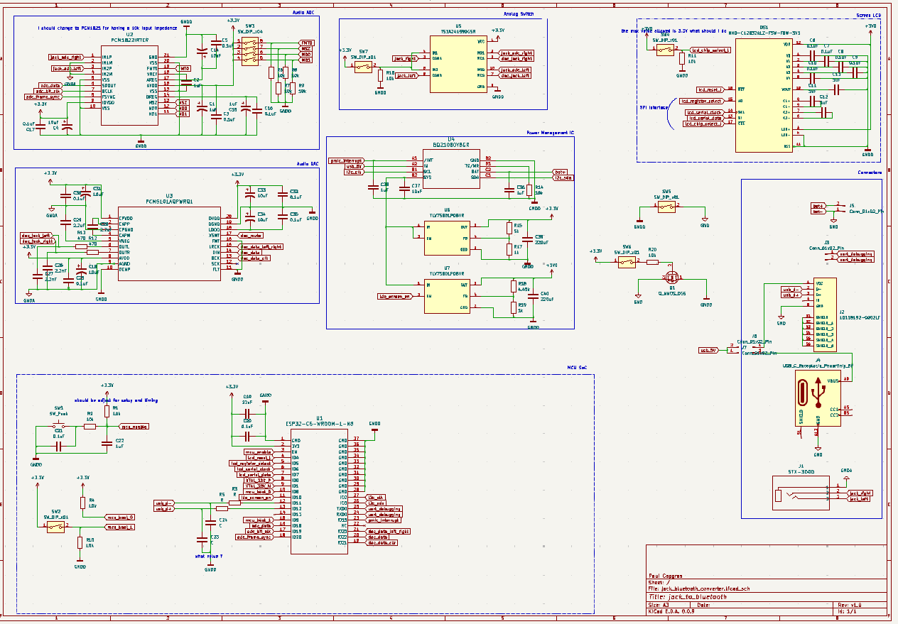
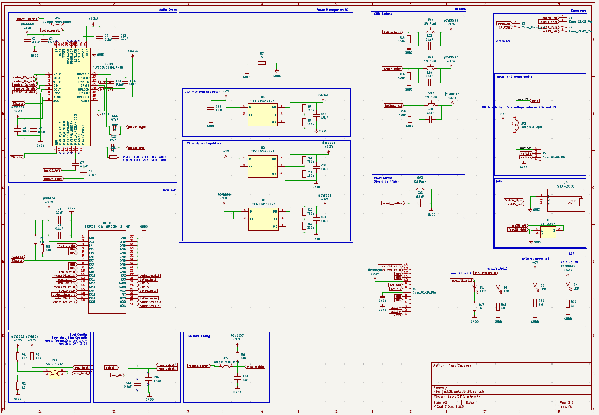
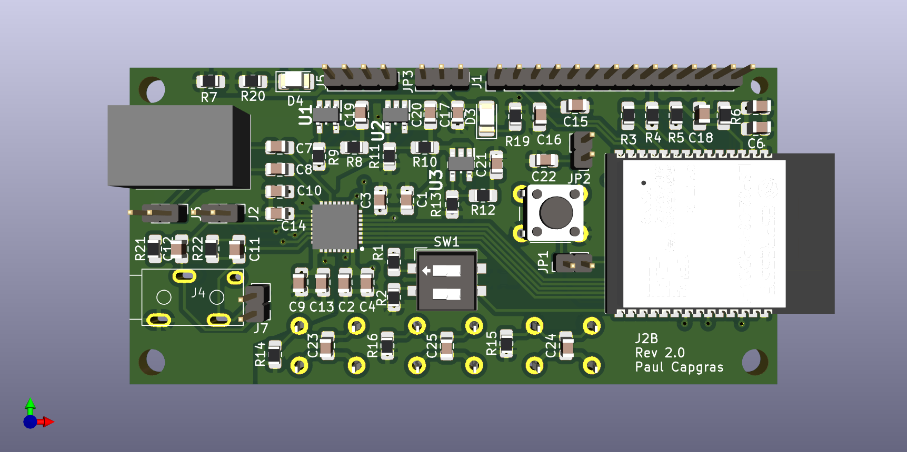
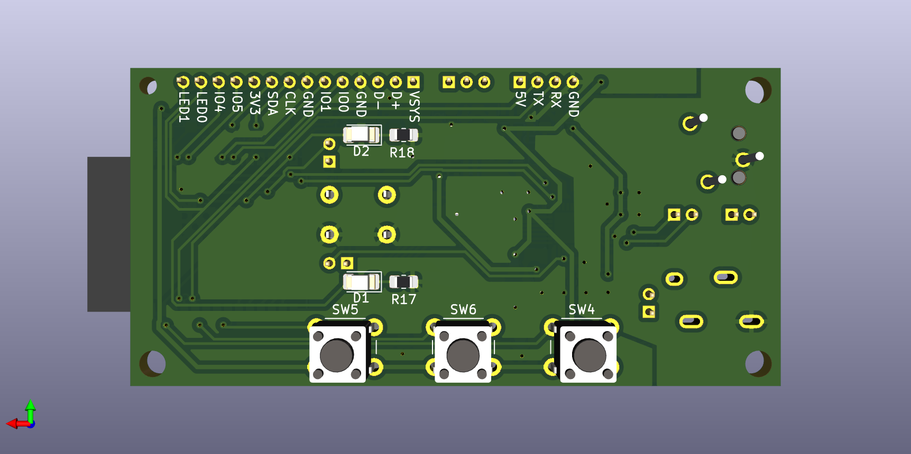
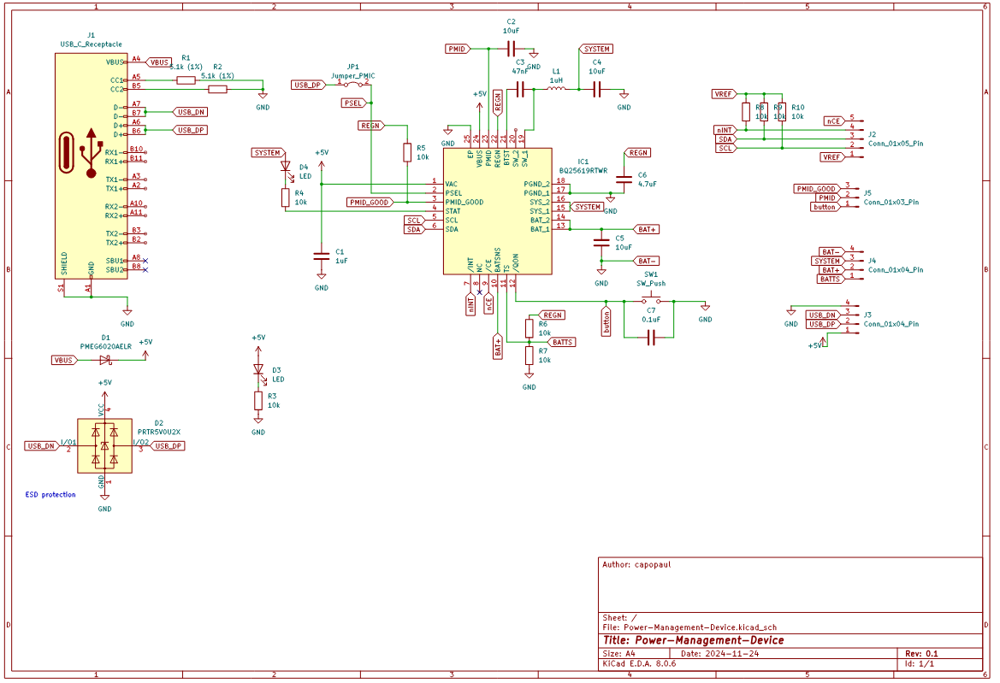
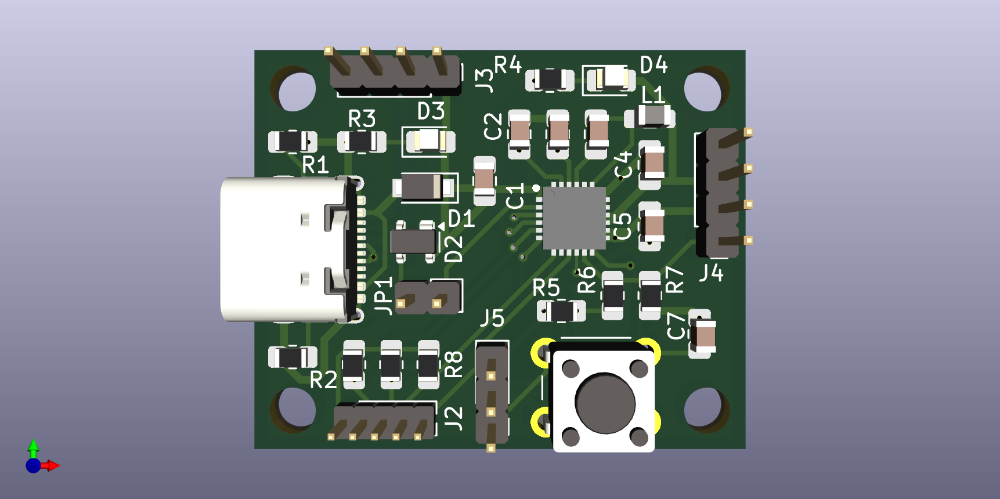
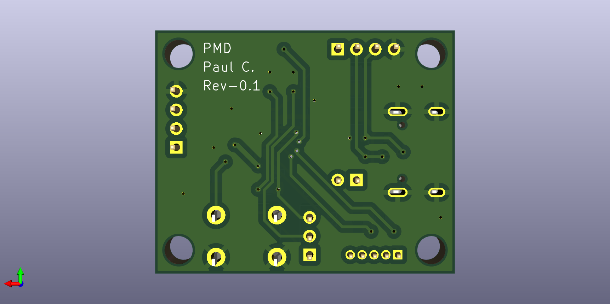
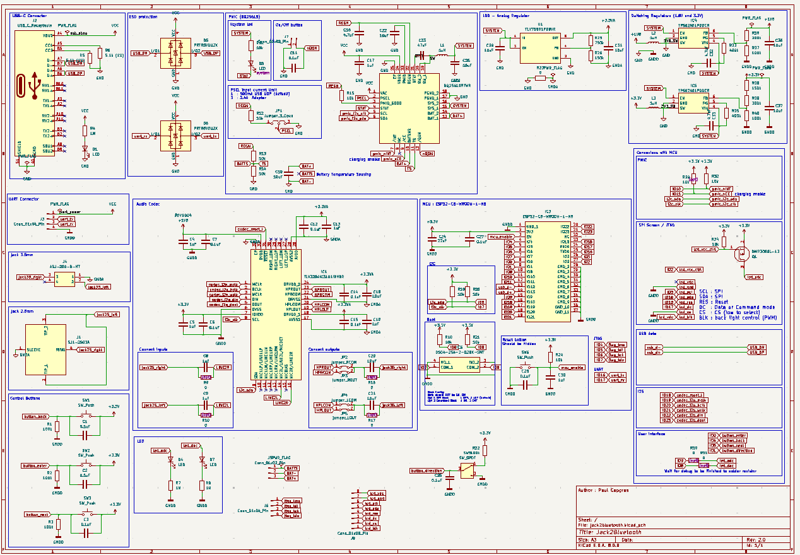
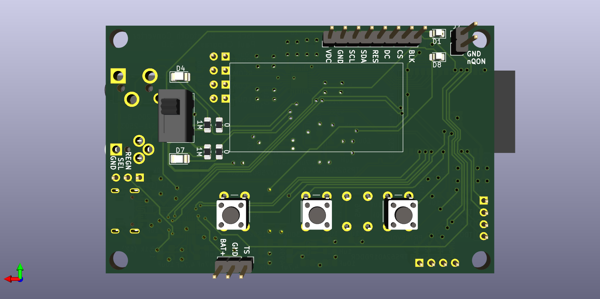

# Jack <> Bluetooth Revision history

## Rev 1.0

Development was halted at the schematic stage because major changes in the schematic were required (moving from one ADC and one DAC to a single CODEC) and the device was difficult to route on a 2-layer PCB.

### Rev 1.0 schematic:

## Rev 2.0

The design was splitted into two separate boards: power and audio. Two schematics and layouts were created. The audio board includes one audio codec instead of the two DAC and ADC.
After a PCB review, this revision was abandoned in favor of a single device with a 4-layer board.

### Rev 2.0 Audio board schematic:

### Rev 2.0 Audio board layout:

### Rev 0.1 Power management device schematic:

### Rev 0.1 Power management device layout:

## Rev 3.0

The current revision, still in progress. Waiting PCB review.

### Changes Compared to Rev 2.0:

- Takes mechanical constraints into account (to design an enclosure).
- Allows the screen power to be shut down using a PMOS control.
- Uses a switching voltage regulator for digital power instead of LDOs.
- Adds ESD protection to the UART.
- Fixes issues, bugs, and bad practices from Rev 2.0.

### Rev 3.0 Schematic :

Also available in pdf: [jack<>bluetooth_rev3.0_schematic.pdf](jack<>bluetooth_rev3.0_schematic.pdf)

### Rev 3.0 Layout :

