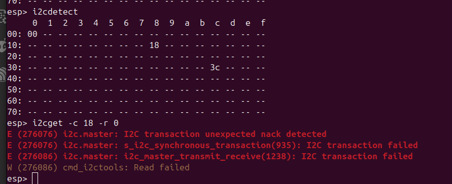
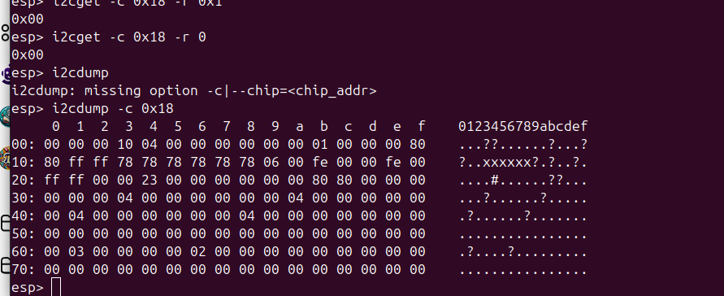
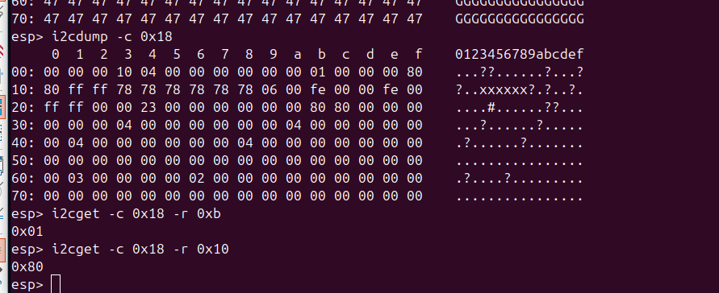

# Jack <> Bluetooth Converter
Revision : 3.0

## Table of Content

1. [Features](#1-features)
2. [Design Specificatin](#2-design-specification)
3. [Repo organization](#3-repo-organization)
4. [Next steps](#4-next-steps)

## 1. Features

This project aims to design a device with the following features:

- Audio input from a 2.5mm audio jack can be sampled and transmitted via Bluetooth to a headphone.
- Digital audio from a smartphone can be received via Bluetooth and converted into analog audio through a 3.5mm audio jack.
- The device can be powered via USB-C or run on battery for up to 3 hours.
- The battery charges when the device is connected to USB-C.
- A screen and buttons allow switching between "Jack to Bluetooth" and "Bluetooth to Jack" modes.
- The screen and buttons enable Bluetooth peripheral selection when the device functions as a Bluetooth central.
- The screen turns off after 1 minute of inactivity to save power.

## 2. Design specification and documentation

Please go to [Jack <> Bluetooth Design Specification](doc/Jack<>Bluetooth-Design-Specification.md) which documents the design choices and provide details on the project.

## 3. Repo organization

`./Components` -> components list with libs (not public yet because of kicad lib licences)

`./doc` -> documentations, specifications and images

`./gerber` -> pcb design files for manufacturing

`./kicad` (not public yet because of kicad lib licences)

`./software` -> ESP32 C code (work in progress)

## 4. Next steps

- PCB review & manufacturing
- finish box design & 3D printing
- Software

## 5. Revisions history

Please go to [Jack<>Bluetooth-Revision-History](doc/Jack<>Bluetooth-Revision-History.md)

## 6. SW Readme

<!-- Author : Paul Capgras -->
<!-- Date   : Jun 14, 2025 -->
Command order:

- `get_idf`
- `idf.py set-target esp32c6`
- `idf.py build`
- `idf.py flash monitor`

Then refer to bringup:

## Bringup

### Boot ESP32-C6 - From UART

- Connect 3.3V UART to 3.3V Pin (temporary)
- Connect GND
- Connect RX to **RX**
- Connect TX to **TX**

- Put 1 of OFF
- Put 2 to ON
- Send the program through UART
    - thanks to the esp idf platform
    - run `get_idf`
    - esp32-c6 should have been also selected
    - `idf.py build` to build
    - `idf.py flash monitor`
    - You might need to push reset button
    - to quit monitor terminal run CTRL-] on querty or CTRL+ALT GR+$ on azerty
- Put 2 to OFF
- Push reset button

- `i2cdetect`
> Ouput should be:
  - 00 -> (ESP Master)
  - 18 -> PMIC
  - 6a -> Audio Codec

### Good practice learnt:

- put a pin for all power lines
- put an arrow for directive lines in the silkscreen
- don't forget direction for the silkscreen for diodes (and leds !)

### Detect I2C peripherals

- use the i2c_tools from `/home/paul/esp/esp-idf/examples/peripherals/i2c`
- go to the clone directory and run the idf commands.
- i2c detect does not detect anything so far
- connect oled i2c screen for a debug purpose. I might need a breadboard to connect grounds. 

### Embedded development

- VS code with esp-idf extension (from Espressif Systems) and C/C++ (from Microsoft).
- Some `#include`might me red, you need to add the esp path to the extension.
- This video explains it at 7min15 : https://www.youtube.com/watch?v=5IuZ-E8Tmhg&t=5s

i2cconfig --port=0 --freq=100000 --sda=6 --scl=7

## Jun 27

- Je tente de remettre 5V sur Vcc et j'observe Vsystem
- Vcc est connecté à mon PMIC donc c'est normal que rien ne se passe sur Vsystem vu que le PMIC est dead.

- Je mets 3.323V sur Vsystem et j'observe:
    - 3.3VA : mesure : 3.321V
    - 1.8VDD: mesure : 1.823V
    - 3.3VDD: mesure : 3.317V

Là ma carte est correctement alimentée. Je peux mener l'enquête

---

La solution c'est de mettre les valeurs en hexa 0x...

---

## Sept 17

### Bringup from USB-C
- Connect USB-C cable
- Send the program
- PB: interaction mode is not working

So go to normal bringup
[Refer to bringup](#bringup)

## Sept 18th

- Copied esp32/a2dp_sink.
- Run it with internal DAC.
- Access with my phone to the device ESP_speaker
- Signal was visible on the oscilloscope!
- Commit is called feat: setup classic bt audio_sink on the esp32 using internal DAC.

Next step use the audio codec. For that, I need to
- configure the audio codec using the esp32-c6.
- send the signal using the other esp.
