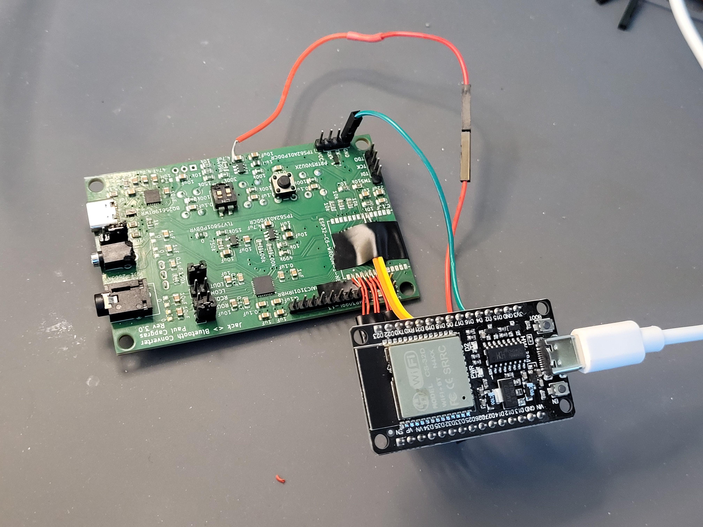
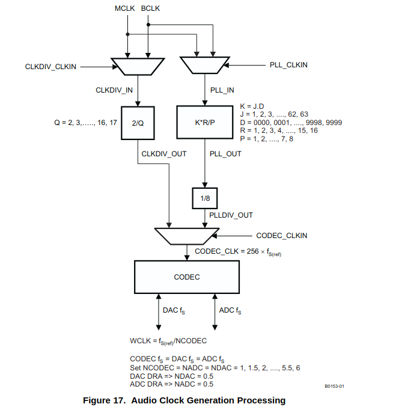
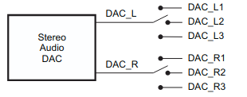
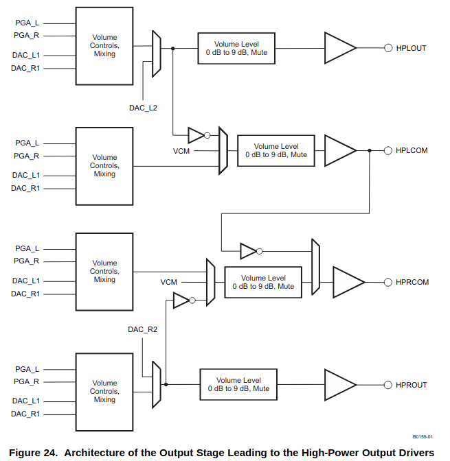
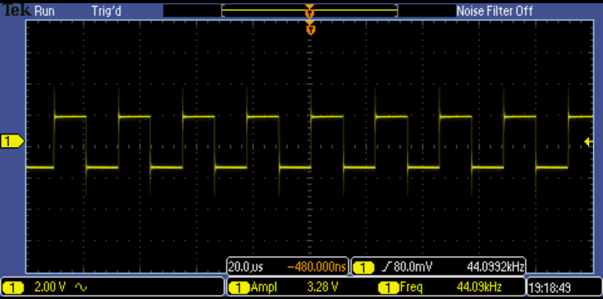

<!-- Author : Paul Capgras -->
<!-- Date   : Jun 14, 2025 -->

# Software Readme

Command order:

- `get_idf`
- `idf.py set-target esp32c6`
- `idf.py build`
- `idf.py flash monitor`

Then refer to bringup:

## Bringup

### Boot ESP32-C6 - From UART

- Connect GND
- Connect RX to **RX**
- Connect TX to **TX**

- Put 1 of OFF
- Put 2 to ON
- Send the program through UART
  - thanks to the esp idf platform
  - run `get_idf`
  - esp32-c6 should have been also selected
  - `idf.py build` to build
  - `idf.py flash monitor`
  - You might need to push reset button
  - to quit monitor terminal run CTRL-] on querty or CTRL+ALT GR+$ on azerty
- Put 2 to OFF
- Push reset button

- `i2cdetect`

> Ouput should be:

- 00 -> (ESP Master)
- 18 -> Audio Codec
- 6a -> PMIC

### Good practice learnt

- put a pin for all power lines
- put an arrow for directive lines in the silkscreen
- don't forget direction for the silkscreen for diodes (and leds !)

### Detect I2C peripherals

- use the i2c_tools from `/home/paul/esp/esp-idf/examples/peripherals/i2c`
- go to the clone directory and run the idf commands.
- i2c detect does not detect anything so far
- connect oled i2c screen for a debug purpose. I might need a breadboard to connect grounds.

### Embedded development

- VS code with esp-idf extension (from Espressif Systems) and C/C++ (from Microsoft).
- Some `#include`might me red, you need to add the esp path to the extension.
- This video explains it at 7min15 : <https://www.youtube.com/watch?v=5IuZ-E8Tmhg&t=5s>

i2cconfig --port=0 --freq=100000 --sda=6 --scl=7

## Jun 27

- Je tente de remettre 5V sur Vcc et j'observe Vsystem
- Vcc est connecté à mon PMIC donc c'est normal que rien ne se passe sur Vsystem vu que le PMIC est dead.

- Je mets 3.323V sur Vsystem et j'observe:
  - 3.3VA : mesure : 3.321V
  - 1.8VDD: mesure : 1.823V
  - 3.3VDD: mesure : 3.317V

Là ma carte est correctement alimentée. Je peux mener l'enquête

---


---

## Sept 17

### Bringup from USB-C

- Connect USB-C cable
- Send the program
- PB: interaction mode is not working

So go to normal bringup
[Refer to bringup](#bringup)

## Sept 18th

- Copied esp32/a2dp_sink.
- Run it with internal DAC.
- Access with my phone to the device ESP_speaker
- Signal was visible on the oscilloscope!
- Commit is called feat: setup classic bt audio_sink on the esp32 using internal DAC.

Next step use the audio codec. For that, I need to

- configure the audio codec using the esp32-c6.
- send the signal using the other esp.

## Oct 1

- Issue 1 : Short between SW et Bat-. It is probably around the PMIC...
  - I want to do an Xray to know if it is the chip, or the soldering
    - No xray equipment at the U
- I have added a wire on system.
- Issue 2 : I can download the pogram on the esp32c6 but I can't leave the download mode.
  - IO9 stays low. Pull up is not working.
    - I removed the esp32c6 as they were no issue on the pcb.
      - Now my voltage does not reach 3.3V anymore on VDD and AVDD. Nor 1.8V on AVDD

## Oct 2

- I have deeply cleaned the board with flux remover and the voltage issue was solved.

## Oct 3

- I have connected 6pins for the i2s and 2 pins for i2c to control these bus with the external esp32 dev kit.

## Oct 6

- I detect PMIC with i2c through external esp.
- I don't detect audio codec.
  - The reset pin goes from 0V to 1.4V. It is supposed to go up to 3.3V in idle.
  - I am trying to remove external alimentation and to power everything with external esp
  - powering everything with esp works - I have all the good voltages. The reset pin of the audio codec does go to 0V and then go back to 3.3V
  - I still do not see my audio codec in 6a...
  - That is because it is supposed to be in 0x18. My README was bad. So no issue I see my audio codec successfully!!!

The board setup now looks like that:


| Pin name | ESP32c6 pin number | External ESP32 devkit pin number |
|-|-|-|
| IO6  | i2c_sda        | IO16 |
| IO7  | i2c_clk        | IO17 |
| IO18 | codec_reset_l  | IO32 |
| IO19 | codec_i2s_mclk | IO33 |
| IO20 | codec_i2s_bclk | IO25 |
| IO21 | codec_i2s_wclk | IO26 |
| IO22 | codec_i2s_din  | IO27 |
| IO23 | codec_i2s_dout | IO14 |

I was working on the folder esp32_b2j.

I have removed what is linked with A2VRCP and try to keep only A2DP.
Now I was trying to make the link with the external I2S codec.
Two parts:

- understand what has been programmed and how is the A2DP send to I2S: What are the I2S parameters
- configure the audio codec according to these parameters

## Oct 10

- I have understood the esp example
- I have reorganized and better name functions
- I have removed the I2S link for now

- I am now configuring the codec.
- I based mon analysis on Figure 26 of the codec spec.
- So I will be using HPL/ROUT

## Oct 11

- I am programming the AudioCodec

### Clocks

I want my clock to be 256 of fs and it is coming from the master clock


- So I choose to use the path on the left.
- CLKDIV_CLKIN need to be enabled and select MCLK - Register 102.
- Q should be be equal to 2 - Register 3.
- CODEC_CLKIN should select CLKDIV_OUT -> Register 101.
- CLK_DIV uses MCLK -> Register 102

```c
// Register 3 - PLL Programming Register A
// D7   - 0    -
// D6-3 - 0010 - Q = 2
// D2-0 - 000  -
is_expected(3, i2c_get(CODEC_ADDR, 3), 0b00010000);

// Register 102 - Clock Generation Control Register
// D7-6 - 00 - CLKDIV_IN selects MCLK
// D5-4 - 0
// D3-0 - 0010
// No need to write
is_expected(102, i2c_get(CODEC_ADDR, 102), 0b00000010);

// Register 101 - Clock register
i2c_get(CODEC_ADDR, 101);
// D7-1 - 0
// D0   - 1 - CODEC_CLKIN uses CLKDIV_OUT
i2c_set(CODEC_ADDR, 101, 0b00000001);
is_expected(101, i2c_get(CODEC_ADDR, 101), 0b00000001);
```

### DAC

I want my audio output on HPR/Lout:



- so according to this : I should put my audio on DAC_L2 and DAC_R2 - Register 41.
- Both DAC should be powered up - Register 37.
- Both DAC should be using fs = 44.1KHz and streaming L/R data - Register 7.
- HPLout should be powered up and unmuted - Register 51
- HPRout should be powered up and unmuted - Register 65

Crash when I send the audio. Honnestly without UART working (as it is used to trasnmit MCLK), it is really a mess to debug.

## Oct 12

I am choosing not to use MCLK from the ESP and to generate the clock internally in my audio codec with the internal PLL using the BCLK as a source.

### Clock

Let's configure the PLL.


- CODEC_CLK (BCLK) = KxRxBCLK/(8xP) = 256 fs = KxRxfs/(8x8xP). Which implies that KxR/P = 64x256. So JxDxR/P = 64x256. Let's take P=1, R=2, J=32, D=256
- Enable PLL and set P in register 3
- Set J in register 4
- Set D in register 5 and 6
- Set R in register 11
- CODEC_CLKIN should select PLLDIV_OUT -> Register 101.
- PLLDIV_IN uses BCLK -> Register 102

```c
/*
  * Clock
  */

// Register 3 - PLL Programming Register A
// D7   - 1    - PLL is enabled
// D6-3 - 0000 -
// D2-0 - 001  - P= 1
i2c_set(CODEC_ADDR, 3, 0b10000001);
is_expected(3, i2c_get(CODEC_ADDR, 3), 0b10000001);

// Register 4 - PLL Programming Register B
// D7-2 - 100000 // Set J to 32
// D1-0 - 00
i2c_set(CODEC_ADDR, 4, 0b10000000);
is_expected(4, i2c_get(CODEC_ADDR, 4), 0b10000000);

// Register 5 and 6
// Set D to 100000000 (256)
// MSB D7-0 (reg 5) 00000100
// LSB D7-2 (reg 6) 000000
// D1-0             00
i2c_set(CODEC_ADDR, 5, 0b00000100);
i2c_set(CODEC_ADDR, 6, 0b00000000);
is_expected(5, i2c_get(CODEC_ADDR, 5), 0b00000100);
is_expected(6, i2c_get(CODEC_ADDR, 6), 0b00000000);

// Register 11 - Audio Codec Overflow Flag Register
// D7-4 0
// D3-0 0010 Set R to 0010
i2c_set(CODEC_ADDR, 11, 0b00000010);
is_expected(11, i2c_get(CODEC_ADDR, 11), 0b00000010);

// Register 102 - Clock Generation Control Register
// D7-6 - 0  -
// D5-4 - 10 - PLLCLK_IN uses BCLK
// D3-0 - 0010
// No need to write
i2c_set(CODEC_ADDR, 102, 0b00100010);
is_expected(102, i2c_get(CODEC_ADDR, 102), 0b00100010);

// Register 101 - Clock register
// D7-1 - 0
// D0   - 0 - CODEC_CLKIN uses PLLDIV_OUT
i2c_set(CODEC_ADDR, 101, 0b00000000);
is_expected(101, i2c_get(CODEC_ADDR, 101), 0b00000000);

```

Let's check if the audio is sent successfully through the i2s interface:

I do have my BCLK visible in the oscilloscope. Not the best clean clock I have seen... The frequency is fs(=44.1) * 256 / 8 = 1.41MHz so that is good. It is a free running clock.


Ws is also free running.


The Dout is also good when sending an audio:


-> Not working. Three possibilities the overshoot are problematic. And/Or the PLL is bad. And/Or the DAC is badly configured.

1. Let's have a faster BCLK with the ESP to enter spec recommendation in the example:

I add a slot of 32 bits instead of 16. This double my BCLK clock.
fs = 44.1kHz
So BCLK = fs*256/4 = 2.822MHz

PLLCLK_IN = 2.822MHz so we have 2MHz < PLLCLK_IN < 20MHz (that is the condition that was not respected before).

fS(ref) = (PLLCLK_IN × K × R)/(2048 × P)

fS(ref) = (256xfS(ref)/4 × K × R)/(2048 × P),

1 = (256 × K × R)/(4x2048 × P),

**P = 1**

KxR = 4x2048/256 = 32

K = J.D => **D=0**, **J = 32**

Other constraint:
80 MHz ≤ (PLLCLK _IN × K × R/P ) ≤ 110 MHz

**R=1**

80MHz < 90MHz < 110MHz - GOOD

Final contraint:

4 ≤ J=16 ≤ 55 - GOOD

``` c
// Register 3 - PLL Programming Register A
// D7   - 1    - PLL is enabled
// D6-3 - 0000 -
// D2-0 - 001  - P= 1
i2c_set(CODEC_ADDR, 3, 0b10000001);
is_expected(3, i2c_get(CODEC_ADDR, 3), 0b10000001);

// Register 4 - PLL Programming Register B
// D7-2 - 10000 // Set J to 32
// D1-0 - 00
i2c_set(CODEC_ADDR, 4, 0b01000000);
is_expected(4, i2c_get(CODEC_ADDR, 4), 0b01000000);

// Register 5 and 6
// Set D to 0
// MSB D7-0 (reg 5) 0
// LSB D7-2 (reg 6) 0
// D1-0             0
// always write both, and in the order reg5 then reg6.
is_expected(5, i2c_get(CODEC_ADDR, 5), 0b00000000);
is_expected(6, i2c_get(CODEC_ADDR, 6), 0b00000000);

// Register 11 - Audio Codec Overflow Flag Register
// D7-4 0
// D3-0 0010 Set R to 0001
i2c_set(CODEC_ADDR, 11, 0b00000010);
is_expected(11, i2c_get(CODEC_ADDR, 11), 0b00000010);

// Register 102 - Clock Generation Control Register
// D7-6 - 0  -
// D5-4 - 10 - PLLCLK_IN uses BCLK
// D3-0 - 0010
// No need to write
i2c_set(CODEC_ADDR, 102, 0b00100010);
is_expected(102, i2c_get(CODEC_ADDR, 102), 0b00100010);

// Register 101 - Clock register
// D7-1 - 0
// D0   - 0 - CODEC_CLKIN uses PLLDIV_OUT
i2c_set(CODEC_ADDR, 101, 0b00000000);
is_expected(101, i2c_get(CODEC_ADDR, 101), 0b00000000);
```

2. Let's filter this signals to have cleaner signals.

### DAC

I want my audio output on HPR/Lout:


- so according to this : I should put my audio on DAC_L2 and DAC_R2 - Register 41.
- Both DAC should be powered up - Register 37.
- Both DAC should be using fs = 44.1KHz and streaming L/R data - Register 7.
- HPLout should be powered up and unmuted - Register 51
- HPRout should be powered up and unmuted - Register 65

Missing configuration:

- Unmute L-DAC - Register 43
- Unmute R-DAC - Register 44

---

I have not been able to make it work yet.

My rise timing is bad with the current resistor (220 ohm) around 70ns.
Spec required 4ns. I don't see how I could reach it though...

Going to 100Ohm is better around 20-30ns

50 Ohms overshoot...

---

Also I did not configured my audio codec after these edits regarding the slot offset.
