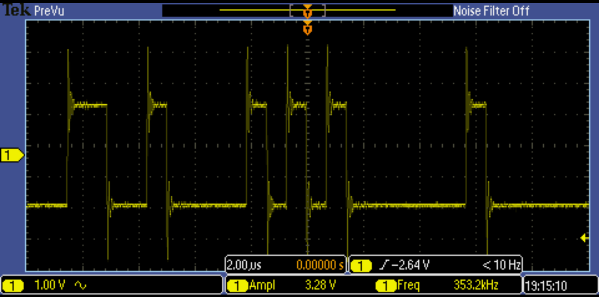

<!-- Author : Paul Capgras -->
<!-- Date   : Jun 14, 2025 -->

# Software Readme

Command order:

- `get_idf`
- `idf.py set-target esp32`
- `idf.py build`
- `idf.py flash monitor`

Then refer to bringup:

## Bringup

- Connect GND
- Connect RX to **TX**
- Connect TX to **RX**

- Send the program through UART
  - thanks to the esp idf platform
  - run `get_idf`
  - esp32 should have been also selected
  - `idf.py build` to build
  - power up the board via usb-c
  - connect the UART device using an usb-c to usb cable.
  - check macos detect the device `ls /dev/cu.*`
  - Push SW 4 (left) down
  - flash the program `idf.py flash monitor`
  - You might need to push reset button (SW 6, right, close to the esp32)
  - to quit monitor terminal run CTRL-] on querty or CTRL+ALT GR+$ on azerty

> Ouput should be:

- 0x00 -> (ESP Master)
- 0x20 -> IO Expander
- 0x18 -> Audio Codec
- 0x6a -> PMIC

## Detect I2C peripherals

- use the i2c_tools from `/home/paul/esp/esp-idf/examples/peripherals/i2c`
- go to the clone directory and run the idf commands.
- i2c detect does not detect anything so far
- connect oled i2c screen for a debug purpose. I might need a breadboard to connect grounds.

## Embedded development

- VS code with esp-idf extension (from Espressif Systems) and C/C++ (from Microsoft).
- Some `#include`might me red, you need to add the esp path to the extension.
- This video explains it at 7min15 : <https://www.youtube.com/watch?v=5IuZ-E8Tmhg&t=5s>
- You can also use `CMD+SHIFT+P`, then click `ESP-IDF: Add VS Code Configuration Folder`.
- You will need to build the project with `idf.py build` and it should solve all the issues

## Development Notes

- [Former Development Notes of Rev3.0](./Development%20Notes%20of%20Rev3.0.md).

### Clocks

The is an issue on my PCB with i2s_mclk. It was supposed to be IO0 and it turns out to be TXD0...

So let's try not to use i2s_mclk and only i2s_bclk.


The goal is to have : `CODEC_CLK = 256 x fs`.

- `fs = 44,100 Hz`
- So the goal is to have : `CODEC_CLK = 256 x fs = 11.2896 MHz`.
- Right now, `BCLK = 2.822 MHz` with 16 bit stereo but 32 bit slots.
- So in the clock path I choose to use the path on the right, using the audio codec internal PLL.
- `PLLDIV_OUT = BLCK x K x R / (8 x P) = BLCK x (J.D) x R / (8 x P)`
- **Warning** J is the integer portion of K (the numbers to the left of the decimal point), while D is the fractional portion of K.
- `P = 1, R = 1, D = 0, J = 32` should work
- `PLL_CLKIN` needs to be set
- `CODEC_CLKIN` needs to be set

### DAC


Goal: I want my audio output on HPR/Lout:

- so according to this : I should put my audio on DAC_L2 and DAC_R2 - Register 41.
- Both DAC should be powered up - Register 37.
- Both DAC should be using fs = 44.1KHz and streaming L/R data - Register 7.
- HPLout should be powered up and unmuted - Register 51
- HPRout should be powered up and unmuted - Register 65

Crash when I send the audio. Honnestly without UART working (as it is used to trasnmit MCLK), it is really a mess to debug.

<!-- 
## Oct 12

I am choosing not to use MCLK from the ESP and to generate the clock internally in my audio codec with the internal PLL using the BCLK as a source.

### Clock

Let's configure the PLL.


- CODEC_CLK (BCLK) = KxRxBCLK/(8xP) = 256 fs = KxRxfs/(8x8xP). Which implies that KxR/P = 64x256. So JxDxR/P = 64x256. Let's take P=1, R=2, J=32, D=256
- Enable PLL and set P in register 3
- Set J in register 4
- Set D in register 5 and 6
- Set R in register 11
- CODEC_CLKIN should select PLLDIV_OUT -> Register 101.
- PLLDIV_IN uses BCLK -> Register 102

```c
/*
  * Clock
  */

// Register 3 - PLL Programming Register A
// D7   - 1    - PLL is enabled
// D6-3 - 0000 -
// D2-0 - 001  - P= 1
i2c_set(CODEC_ADDR, 3, 0b10000001);
is_expected(3, i2c_get(CODEC_ADDR, 3), 0b10000001);

// Register 4 - PLL Programming Register B
// D7-2 - 100000 // Set J to 32
// D1-0 - 00
i2c_set(CODEC_ADDR, 4, 0b10000000);
is_expected(4, i2c_get(CODEC_ADDR, 4), 0b10000000);

// Register 5 and 6
// Set D to 100000000 (256)
// MSB D7-0 (reg 5) 00000100
// LSB D7-2 (reg 6) 000000
// D1-0             00
i2c_set(CODEC_ADDR, 5, 0b00000100);
i2c_set(CODEC_ADDR, 6, 0b00000000);
is_expected(5, i2c_get(CODEC_ADDR, 5), 0b00000100);
is_expected(6, i2c_get(CODEC_ADDR, 6), 0b00000000);

// Register 11 - Audio Codec Overflow Flag Register
// D7-4 0
// D3-0 0010 Set R to 0010
i2c_set(CODEC_ADDR, 11, 0b00000010);
is_expected(11, i2c_get(CODEC_ADDR, 11), 0b00000010);

// Register 102 - Clock Generation Control Register
// D7-6 - 0  -
// D5-4 - 10 - PLLCLK_IN uses BCLK
// D3-0 - 0010
// No need to write
i2c_set(CODEC_ADDR, 102, 0b00100010);
is_expected(102, i2c_get(CODEC_ADDR, 102), 0b00100010);

// Register 101 - Clock register
// D7-1 - 0
// D0   - 0 - CODEC_CLKIN uses PLLDIV_OUT
i2c_set(CODEC_ADDR, 101, 0b00000000);
is_expected(101, i2c_get(CODEC_ADDR, 101), 0b00000000);

```

Let's check if the audio is sent successfully through the i2s interface:

I do have my BCLK visible in the oscilloscope. Not the best clean clock I have seen... The frequency is fs(=44.1) * 256 / 8 = 1.41MHz so that is good. It is a free running clock.


Ws is also free running.


The Dout is also good when sending an audio:


-> Not working. Three possibilities the overshoot are problematic. And/Or the PLL is bad. And/Or the DAC is badly configured.

1. Let's have a faster BCLK with the ESP to enter spec recommendation in the example:

I add a slot of 32 bits instead of 16. This double my BCLK clock.
fs = 44.1kHz
So BCLK = fs*256/4 = 2.822MHz

PLLCLK_IN = 2.822MHz so we have 2MHz < PLLCLK_IN < 20MHz (that is the condition that was not respected before).

fS(ref) = (PLLCLK_IN × K × R)/(2048 × P)

fS(ref) = (256xfS(ref)/4 × K × R)/(2048 × P),

1 = (256 × K × R)/(4x2048 × P),

**P = 1**

KxR = 4x2048/256 = 32

K = J.D => **D=0**, **J = 32**

Other constraint:
80 MHz ≤ (PLLCLK _IN × K × R/P ) ≤ 110 MHz

**R=1**

80MHz < 90MHz < 110MHz - GOOD

Final contraint:

4 ≤ J=16 ≤ 55 - GOOD

``` c
// Register 3 - PLL Programming Register A
// D7   - 1    - PLL is enabled
// D6-3 - 0000 -
// D2-0 - 001  - P= 1
i2c_set(CODEC_ADDR, 3, 0b10000001);
is_expected(3, i2c_get(CODEC_ADDR, 3), 0b10000001);

// Register 4 - PLL Programming Register B
// D7-2 - 10000 // Set J to 32
// D1-0 - 00
i2c_set(CODEC_ADDR, 4, 0b01000000);
is_expected(4, i2c_get(CODEC_ADDR, 4), 0b01000000);

// Register 5 and 6
// Set D to 0
// MSB D7-0 (reg 5) 0
// LSB D7-2 (reg 6) 0
// D1-0             0
// always write both, and in the order reg5 then reg6.
is_expected(5, i2c_get(CODEC_ADDR, 5), 0b00000000);
is_expected(6, i2c_get(CODEC_ADDR, 6), 0b00000000);

// Register 11 - Audio Codec Overflow Flag Register
// D7-4 0
// D3-0 0010 Set R to 0001
i2c_set(CODEC_ADDR, 11, 0b00000010);
is_expected(11, i2c_get(CODEC_ADDR, 11), 0b00000010);

// Register 102 - Clock Generation Control Register
// D7-6 - 0  -
// D5-4 - 10 - PLLCLK_IN uses BCLK
// D3-0 - 0010
// No need to write
i2c_set(CODEC_ADDR, 102, 0b00100010);
is_expected(102, i2c_get(CODEC_ADDR, 102), 0b00100010);

// Register 101 - Clock register
// D7-1 - 0
// D0   - 0 - CODEC_CLKIN uses PLLDIV_OUT
i2c_set(CODEC_ADDR, 101, 0b00000000);
is_expected(101, i2c_get(CODEC_ADDR, 101), 0b00000000);
```

1. Let's filter this signals to have cleaner signals.

### DAC

I want my audio output on HPR/Lout:


- so according to this : I should put my audio on DAC_L2 and DAC_R2 - Register 41.
- Both DAC should be powered up - Register 37.
- Both DAC should be using fs = 44.1KHz and streaming L/R data - Register 7.
- HPLout should be powered up and unmuted - Register 51
- HPRout should be powered up and unmuted - Register 65

Missing configuration:

- Unmute L-DAC - Register 43
- Unmute R-DAC - Register 44
 -->
